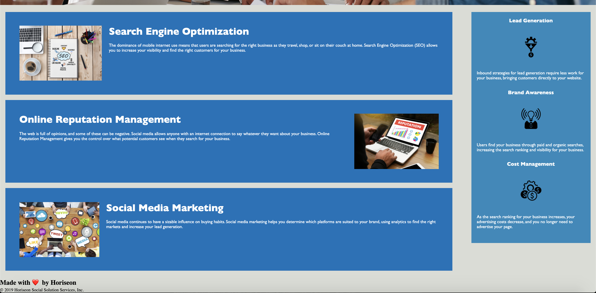

# Horiseon Refractor
In this project, I was asked to refactor existing code to make a codebase that "follows accessibility standards so that the site is optimized for search engines."  First, I changed the title from "website" to "Horiseon" and then went through the code and added semantic HTML elements that were missing.  I noticed that one of the links in the navigation was not working, so I added to correct code to fix it.  Next, I added alternate text to each image on the site to increase the accessibility of the page.  I also added hidden comments to remind myself what changes I made and where different parts of the webpage were coded.

When I was finished with the HTML, I looked at the stylesheet and moved the css for the content sections up above the css for the benefits section.  I did this so that the css followed the same flow as the HTML code. I had to adjust the top margin on the benefits box to bring it up inline with the top content section.

https://github.com/sgenesi/Horiseon

https://sgenesi.github.io/Horiseon/

